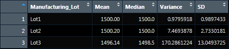
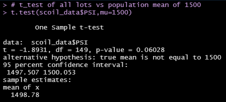
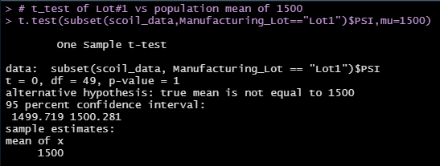
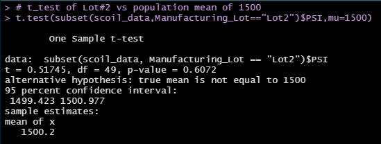
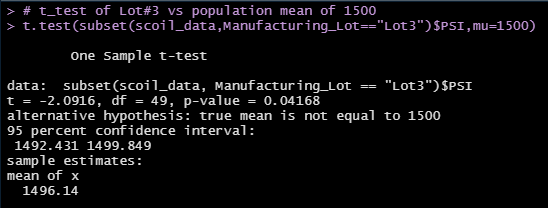

# MechaCar Statistical Analysis
Statistical Analysis with R

## Linear Regression to Predict MPG
* Independant Variable: MPG; Dependant Variables: vehicle length, vehicle weight, spoiler angle, ground clearance and AWD.
* In analysing the multiple linear regression model for the Mechacar prototypes: vehicle length and ground clearance are statistically unlikely to provide random amounts of variance to MPG. In other words the vehicle length and ground clearance have a significant impact on miles per gallon.
* All dependant variables in the analysis had non-zero coefficients, giving a non-zero slope to the model overall.
* In totality, the multiple r-squared value of 0.71 coupled with only two signifigant variables (vehicle length & ground clearance) gives evidence of the model overfitting.

## Summary Statistics on Suspension Coils
* The design specifications for the MechaCar suspension coils dictate that the variance of the suspension coils must not exceed 100 pounds per square inch.

Figure 1.) PSI(pounds per square inch) Mean, Median, Variance & Standard Deviation for All Suspension Coils.

Figure 2.) PSI(pounds per square inch) Mean, Median, Variance & Standard Deviation for Suspension Coils by Manufacturing Lot.

 
 * While the overall inventory of suspension coils were within the design specification of variance for PSI (<100), those from Manufacturing Lot #3 showed to be very noticably outside the specification, almost double.

## T-Tests on Suspension Coils
* Assuming a normal distribution of PSI in a population of suspension coils with a mean of 1500 PSI (standard deviation of 1):

Figure 3.) t-test of PSI in All Manufacturing Lots compared to a Normal Distribution Poplation.

* The overall manufacturing lots produced a p-value of 0.06, slight above the common signifigance level of 0.05. This indicates there is a small statistical difference between the observed sample mean and its presumed population mean.

Figure 4.) t-test of PSI in Manufacturing Lot #1 compared to a Normal Distribution Poplation.

* Manufacturing lot #1 produced a p-value of 1, indicating no statistical difference to the presumed population mean.

Figure 5.) t-test of PSI in Manufacturing Lot #2 compared to a Normal Distribution Poplation.

* Manufacturing lot #2 produced a p-value of 0.60, indicating no statistical difference to the presumed population mean.

Figure 6.) t-test of PSI in Manufacturing Lot #3 compared to a Normal Distribution Poplation.

* Manufacturing lot #3 produced a p-value of 0.04, indicating a statistical difference to the presumed population mean.

